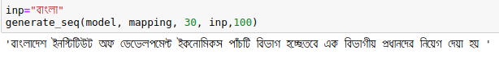

<h1>Bangla Text generator Character Level</h1>
<p>This project generates certain level of Bangla character based on a given number and some Bangla character as a context 
value. To make it workable, a Recurrent Neural Network Model is trained on Bangla Wiki corpus and it achieves a satisfactory
level performance. </p>

## Dependecies
1. This project is tested on CPU Core i5 (6th Gen), 8 GB RAM
2. Tensorflow 1.13.1
3. Python 3.6.7
4. Keras 2.2.4 

## Requirements 
Install requirements packages by running the following command <br>
```pip install -r requirments.txt```

## Data-Set
Keep Bangla wiki corpus data into data forlder. 
## Results
<p><h5> X-axis indicares predicted class and Y-axis indicates original class. </h5> </p>

